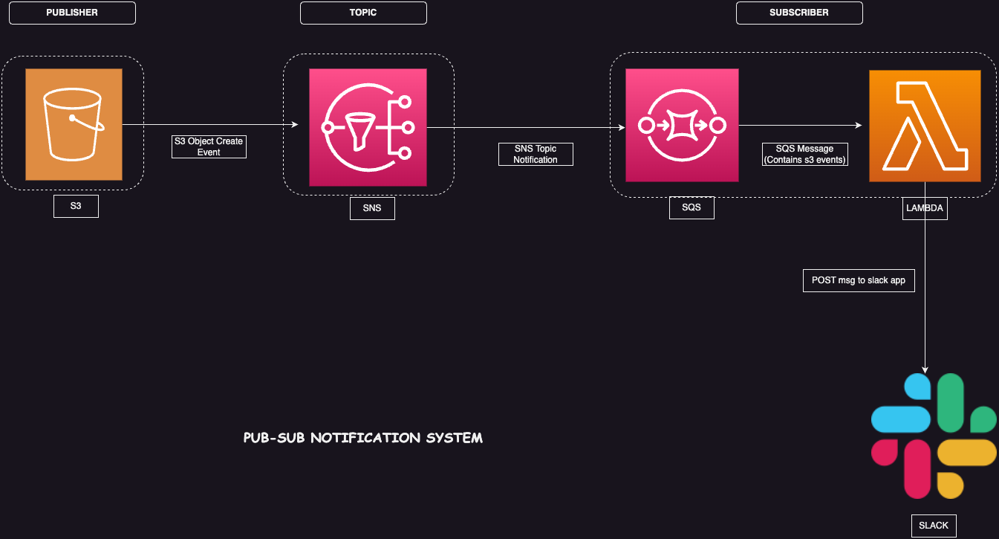
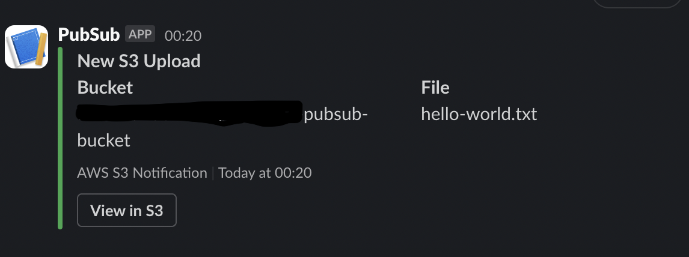

# Pub/Sub Notification System with S3, SNS, SQS, and Lambda
## Overview
This project implements a Pub/Sub notification system using AWS services. The system is designed to send notifications to Slack whenever a new file is uploaded to an S3 bucket. The architecture includes S3, SNS, SQS, and Lambda functions to achieve a scalable and decoupled solution.

## Architecture

The architecture consists of the following components:

1. **S3 Bucket**: Acts as the source of events when new files are uploaded.
2. **SNS Topic**: Receives event notifications from S3 and fans out messages to SQS queues.
3. **SQS Queue**: Buffers the messages from the SNS topic, decoupling the event source from the processing logic.
4. **Lambda Function**: Processes messages from the SQS queue, formats the message into a Slack-compatible format, and sends it to Slack.

## Detailed Workflow
1. **S3 Event**: When a new file is uploaded to the S3 bucket, an event notification is sent to the SNS topic.
2. **SNS Topic**: The SNS topic fans out the event notification to the SQS queue.
3. **SQS Queue**: Buffers the incoming messages.
4. **Notification Lambda**: Triggered by the SQS queue. It formats the message into a Slack notification with a card containing details and a button linking to the S3 bucket, then sends it to the Slack webhook URL.
5. **Slack Notification**: The Slack message is sent to the specified Slack channel, providing a detailed and formatted notification about the new file upload.


## Prerequisites
1. AWS account with appropriate permissions.
2. AWS CLI installed and configured.
3. AWS CDK (Cloud Development Kit) installed.
4. A Slack workspace and an incoming webhook URL.
5. Node Installed.
6. Python

## Setup and Deployment

### Clone the repository:

```sh
git clone https://github.com/kkverma/pub-sub-notification-system.git.git
cd pub-sub-notification-system
```
### Install dependencies:

```sh
pip install -r requirements.txt
```
### Set up environment variables:

Create a .env file in the project root directory and add the Slack webhook URL:
```sh
SLACK_WEBHOOK_URL=https://hooks.slack.com/services/your/slack/webhook
```

### Deploy the CDK stack:

```sh
cdk deploy
```
### CDK Stack
Here is the CDK stack definition (in Python):

```python
from aws_cdk import (
    # Duration,
    RemovalPolicy,
    Stack,
    # aws_sqs as sqs,
    aws_s3 as s3,
    aws_kms as kms,
    aws_iam as iam,
    aws_sns as sns,
    aws_sqs as sqs,
    aws_lambda as _lambda,
    aws_sns_subscriptions as sns_subscriptions,
    aws_lambda_event_sources as lambda_event_sources,
    aws_s3_notifications as s3_notifications
)
from constructs import Construct

class PubSubStack(Stack):

    def __init__(self, scope: Construct, construct_id: str, **kwargs) -> None:
        super().__init__(scope, construct_id, **kwargs)

        account_id = self.node.try_get_context('ACCOUNT_ID')
        app_name = self.node.try_get_context('APP_NAME')

        # Kms key
        key = kms.Key(self, f'{app_name}Key',
                      alias= f'{app_name}KeyAlias',
                      description='Key for PubSub')
        
        key.grant_encrypt_decrypt(iam.AccountRootPrincipal())

        # s3 bucket       
        s3_bucket = s3.Bucket(self, 
                              f'{app_name}Bucket',
                              bucket_name=f'{account_id}-ap-south-1-pubsub-bucket',
                              encryption_key=key,
                              removal_policy=RemovalPolicy.DESTROY,
                              auto_delete_objects=True
                              )
        # sns topic
        sns_topic = sns.Topic(self, f'{app_name}Topic',
                              topic_name=f'{app_name}Topic')
        
        # sqs queue
        sqs_queue = sqs.Queue(self, f'{app_name}Queue',
                              queue_name=f'{app_name}Queue')
        
        # lambda layer for external libraries used in lambda
        lambda_layer = _lambda.LayerVersion(self, f'{app_name}LambdaLayer',
            code=_lambda.Code.from_asset("./assets/lambda_layer"),
            compatible_runtimes=[_lambda.Runtime.PYTHON_3_9],
            description="A layer to include requests package"
        )
        
        # lambda function
        lambda_function = _lambda.Function(self, f'{app_name}LambdaFunction',
            function_name=f'{app_name}LambdaFunction',
            runtime=_lambda.Runtime.PYTHON_3_9,
            handler="handler.main",
            code=_lambda.Code.from_asset("./assets/lambda"),
            layers=[lambda_layer],
            environment={
                'SLACK_WEBHOOK_URL': self.node.try_get_context('SLACK_WEBHOOK_URL')  # Slack Webhook URL as environment variable
            }
        )

        # Add sqs subscription to sns topic
        sns_topic.add_subscription(sns_subscriptions.SqsSubscription(sqs_queue))

        # Add sqs as event source for lambda function
        sqs_queue.grant_consume_messages(lambda_function)
        lambda_function.add_event_source(lambda_event_sources.SqsEventSource(sqs_queue))

        # Add s3 event notification to sns topic
        s3_bucket.add_event_notification(s3.EventType.OBJECT_CREATED, s3_notifications.SnsDestination(sns_topic))


app = cdk.App(
    context= {
        'ACCOUNT_ID': os.getenv('AWS_ACCOUNT_ID'),
        'APP_NAME': 'PubSub',
        'SLACK_WEBHOOK_URL': os.getenv('SLACK_WEBHOOK_URL')
    }
)
stack = PubSubStack(app, "PubSubStack",
    env=cdk.Environment(account=os.getenv('AWS_ACCOUNT_ID'), region='ap-south-1'),
    )

app.synth()

```

### Lambda Function Code
Create a lambda directory and add a handler.py file with the following code:

```python
import json
import os
import requests
from datetime import datetime

def main(event, context):
    slack_webhook_url = os.getenv('SLACK_WEBHOOK_URL')

    for record in event['Records']:
        # Process the SQS message
        sns_message = json.loads(record['body'])
        s3_event = json.loads(sns_message['Message'])
        print(s3_event)

        for s3_record in s3_event['Records']:
            s3_bucket_name = s3_record['s3']['bucket']['name']
            s3_object_key = s3_record['s3']['object']['key']
            event_time = s3_record['eventTime']

            # Convert eventTime to a Unix timestamp
            event_datetime = datetime.strptime(event_time, "%Y-%m-%dT%H:%M:%S.%fZ")
            timestamp = int(event_datetime.timestamp())
            # Generate S3 object URL
            s3_object_url = f"https://s3.console.aws.amazon.com/s3/object/{s3_bucket_name}/{s3_object_key}?region=ap-south-1"


            # Format the Slack message
            slack_message = {
                "attachments": [
                    {
                        "fallback": f"New file uploaded to {s3_bucket_name}",
                        "color": "#36a64f",
                        "title": "New S3 Upload",
                        "fields": [
                            {
                                "title": "Bucket",
                                "value": s3_bucket_name,
                                "short": True
                            },
                            {
                                "title": "File",
                                "value": s3_object_key,
                                "short": True
                            }
                        ],
                        "footer": "AWS S3 Notification",
                        "ts": timestamp,
                        "actions": [
                            {
                                "type": "button",
                                "text": "View in S3",
                                "url": s3_object_url
                            }
                        ]
                    }
                ]
            }

            # Send message to Slack
            response = requests.post(slack_webhook_url, json=slack_message)

            if response.status_code != 200:
                raise ValueError(f"Request to slack returned an error {response.status_code}, the response is:\n{response.text}")

    return {"statusCode": 200, "body": json.dumps('Message processed')}

```

### Testing
1. Upload a file to the configured S3 bucket.
    `aws s3 cp hello-world.txt s3://{BUCKET_NAME}/`
2. Check the specified Slack channel for a notification about the new file upload.

3. Do not forget to clean your aws stacks after testing.
    `cdk destroy`

### Conclusion
This project demonstrates how to build a scalable and decoupled Pub/Sub notification system using AWS services. By leveraging S3, SNS, SQS, Lambda, and Slack, we can efficiently handle file upload events and notify stakeholders in real-time.